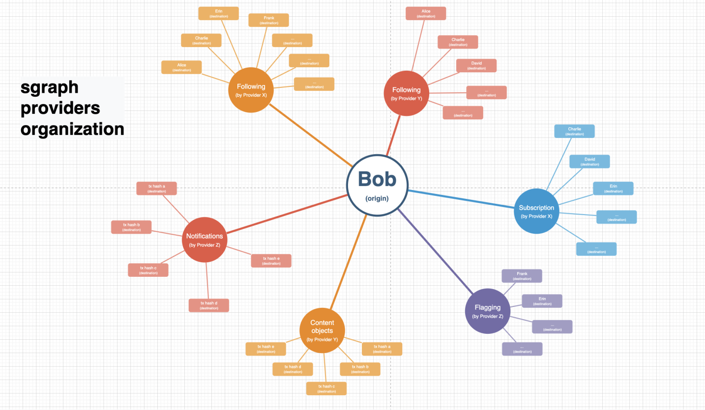

# sgraph

Welcome to monorepo with all code related to sgraph

### **What is sgraph?**
sgraph is a protocol open that allows different providers to publish and query relations (connections) about two users in permissionless manner. For example one party might publish relation `user A follows user B` while other party publishes `user A bought item from user B`. Instead of storing those relations locally sgraph allows both parties to share them on-chain so both of them (and others) could benefit for potencial contacts from sharing info about the same users

Some of the features of sgraph are:
* Permissionless
* High performance and throughput
* Simple yet extensible protocol

### **How it works**


[Full diagram link](https://www.figma.com/file/pDDwMj0q1ugxiyxqdLEPAE/The-Graph?node-id=0%3A1&t=g19jtoCljwevG175-0)

### **Implementation**
sgraph is operating on Solana blockchain. Core contract manages all writes to the graph.

In order to consume as little space as possible while making writes essentially free, sgraph uses technology called [SPL Account Compression](https://github.com/solana-labs/solana-program-library/tree/master/account-compression). Instead of actual data (relations), only hashes are stored on-chain. Naturally, in order to read data it has to be indexed somewhere off-chain. To do this, one must run `indexer` - a dedicated binary that maintains a local copy of all the relations.

We aim to make `indexer` easy to deploy and maintain, so that it's benefits (such as incredible read performace) outweigh the initial investment in setting it up. Hosted version of `indexer` will also be available.

### **Project structure:**
```
|-- programs
|   |-- graph => Core contract
|   `-- usersig => Manual signature provider (checkout out it's README.md)
|       `-- cli => Utilities to create relations using usersig
|-- sdk
|   `-- js => Typescript SDK
|       `-- _examples => Examples of interaction with the graph
|-- indexer => Worker that caches relations locally
```

### **Development environment quick start**
```bash
# start localnet
solana-test-validator

# deploy contracts on localnet
# install anchor at https://www.anchor-lang.com/docs/installation
anchor build && anchor deploy

# run examples
set -x ANCHOR_WALLET "~/.config/solana/id.json" # set to path to your wallet
npx ts-node sdk/js/_examples/full.ts
```

**TODO:**
* CI/CD
* Integration tests
* More SDK helpers
* More providers!

### **License**

Apache 2.0. See [LICENSE](`./LICENSE`)